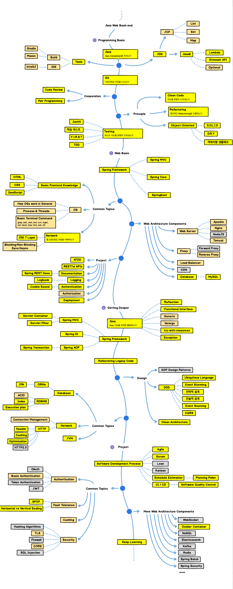

## Inspired By
https://github.com/kamranahmedse/developer-roadmap

## Introduction
우아한테크코스 로드맵 2020년 버전 

- [모집 페이지](https://woowacourse.github.io/)

- [기술 블로그 모음](https://woowabros.github.io/category/techcourse/)

- [홍보기사](https://ppss.kr/archives/201479)

## Introduction

## Backend Roadmap

 

## Contents

### [1. Programming Basic](./docs/1_programming_basic/README.md)

- 프로그래밍 언어에 대한 기본 문법을 익힌다.

- 객체지향 설계를 경험한다.

- 읽기 좋은 코드를 구현하는 것이 왜 중요한지와 코드를 개선해 읽기 좋은 코드로 변경해 보는 경험을 하는 것이 중요하다.

- 자신이 구현한 코드에 대해 단위 테스트를 작성하고 리팩토링하는 경험을 한다.

### [2. Web Basic](./docs/2_web_basic/README.md)

- 웹 애플리케이션을 개발하는 경험을 한다.

- 웹 서비스를 개발하며 필요한 지식(JS, SQL, OS 등)을 익힌다.

### [3. Project](./docs/3_project/README.md)

- 개발 프로세스 기반으로 프로젝트 진행, 협업하는 경험을 한다.

- 배포를 자동화하고, 피드백을 받아 지속적으로 개선하는 경험을 한다.

### [4. Getting Deeper](./docs/4_getting_deeper/README.md)

- 프레임워크의 동작원리를 이해한다.

- 레거시 프로젝트를 리팩토링하는 경험을 한다.

- 추가적으로 학습한 내용들을 기존 프로젝트에 적용하는 경험을 한다.

- 대용량 서비스를 위한 시스템 아키텍처 설계, 데이터 처리 등을 고려한다.

---

## Links

- [Interview_Question_for_Beginner](https://github.com/JaeYeopHan/Interview_Question_for_Beginner)

- [Back-End-Developer-Interview-Questions](https://github.com/arialdomartini/Back-End-Developer-Interview-Questions)

- [awesome-interview-questions](https://github.com/MaximAbramchuck/awesome-interview-questions)

## Mockup Files
The roadmaps are built using [Balsamiq](https://balsamiq.com/products/mockups/). Project file can be found at `/Balsamiq-files` directory. To modify any of the roadmaps, open Balsamiq, click **Project > Import > Mockup JSON**, it will open the roadmap for you, update it.

## License
MIT License

