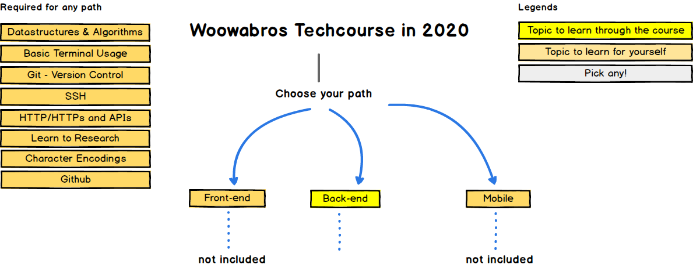
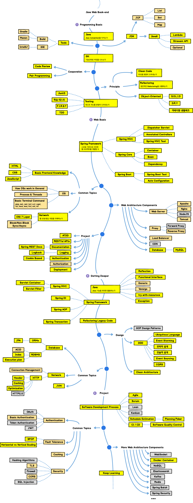

## Inspired By
https://github.com/kamranahmedse/developer-roadmap

## Introduction
우아한테크코스 로드맵 2020년 버전 

- [모집 페이지](https://woowacourse.github.io/)

- [기술 블로그 모음](https://woowabros.github.io/category/techcourse/)

- [홍보기사](https://ppss.kr/archives/201479)

## Introduction

## Backend Roadmap

## Mockup Files
The roadmaps are built using [Balsamiq](https://balsamiq.com/products/mockups/). Project file can be found at `/Balsamiq-files` directory. To modify any of the roadmaps, open Balsamiq, click **Project > Import > Mockup JSON**, it will open the roadmap for you, update it.

## License
MIT License

